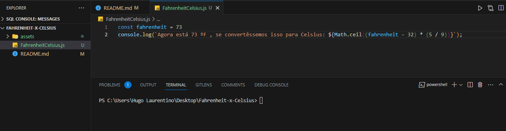

<h1 align="center">
  
</h1>

### Regra de Três

- [x] Bak-End
- [x] Criar Título
- [x] Criar Descrição
- [x] Sobre
- [x] Tecnologia
- [x] Pre requisito
- [x] Autor
- [x] GIF ‘s
---
<h1 align='center'>Regra de Três</h1>

<p align='center'>Esse é um exemplo de logica em javascript</p>

<p align='center'>
	<a href='#sobre'>Sobre</a> |
	<a href='#pré-requisitos'>Pre Requisitos</a> |
	<a href='#tecnologias'>Tecnologias</a> |
	<a href='#autor'>Autor</a>
</p>

---
<h1 align='center'>
	
</h1>

---
### Sobre
  <p align= 'justify'>
  Cálculo da regra de três
  </p>
Dado 3 números, a, b e c, calculamos d utilizando a regra de três.

|   a   |   b   |
| :---: | :---: |
|   c   |   d   |
---
### Pré-requisitos 

Antes de começar, você vai precisar ter instalado em sua máquina as seguintes FERRAMENTAS: [GIT](https://git-scm.com/), [Node.js](https://nodejs.org/en/download). 
Além disto é bom ter um editor para trabalhar com o código como [VSCode](https://code.visualstudio.com/download).

### 🎲 Rodando o Back End

```bash
# Clone este repositório
$ git clone https://github.com/hugolaurentino/Regra-de-tres.git

# Acesse a pasta do projeto no terminal/cmd
$ cd Regra-de-Três

# Instale as dependências
$ npm install

# Execute 
$ node .\Regra-de-Tres.js

```
### Tecnologias 

As seguintes ferramentas foram usadas na construção do projeto:

- [Node.js][nodejs]
---

## Autor

Feito com ❤️ por Hugo Laurentino 👋🏽 [Entre em contato!](https://www.linkedin.com/in/hugo-laurentino-silva/)

[nodejs]: https://nodejs.org/